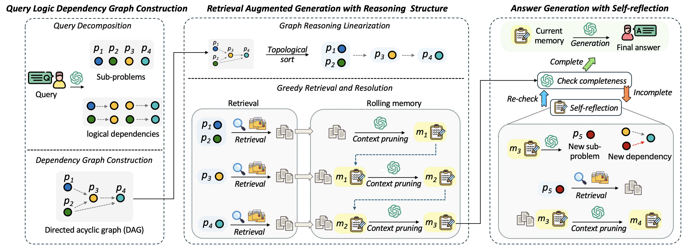

# LogicRAG: Structured RAG Guided by Query Logic Dependency Graph

<div align="center">
    <a href="http://makeapullrequest.com"></a>
      <a href="http://makeapullrequest.com"></a>
      <a href="https://arxiv.org/abs/2508.06105"></a>
</div>

LogicRAG enables structured retrieval without building knowledge graphs on corpora. By constructing query logic dependency graphs to guide structured retrieval adaptively, it enables test-time scaling of graphRAG on large/dynamic knowledge bases. This work has been accepted to **AAAI'26**, with title [You Don't Need Pre-built Graphs for RAG: Retrieval Augmented Generation with Adaptive Reasoning Structures](https://openreview.net/forum?id=ov1bwU35Mf). An updated version also available on [Arxiv](https://arxiv.org/abs/2508.06105).



## 🌟 Key Features

- **❶ Logic Dependency Analysis**: Convert complex questions into logical dependency graphs for planning multi-step retrieval.
- **❷ Graph Reasoning Linearization**: Linearize complex graph reasoning into sequential subproblem solution while maintaining logic-coherence.
- **❸ Efficiency**: Efficient scheduling via graph pruning, and context-length optimization via rolling memory.
- **❹ Interpretable Results**: Provides clear reasoning paths and dependency analysis for better explainability.

## 🚀 Quick Start

### Installation and Configuration

- Install dependencies:

```bash
pip install -r requirements.txt
```

- Set your OpenAI API key:

```bash
# Create a .env file in the root directory with:
OPENAI_API_KEY=your_api_key_here
```

- Other configuration options can be modified in `config/config.py`

### Running Evaluation on a Dataset

```bash
python run.py --model logic-rag --dataset path/to/dataset.json --corpus path/to/corpus.json --max-rounds 5 --top-k 3
```

Options:

- `--max-rounds`: Maximum number of reasoning rounds (default: 3)
- `--top-k`: Number of top contexts to retrieve (default: 5)
- `--limit`: Number of questions to evaluate (default: 20)
  - Set to `0` to process all questions in the dataset

### Running a Single Question

```bash
python run.py --model logic-rag --question "Your question here" --corpus path/to/corpus.json --max-rounds 5 --top-k 3
```

### Example Usage

```python
from src.models.logic_rag import LogicRAG

# Initialize RAG system
rag = LogicRAG('path/to/corpus.json')
rag.set_max_rounds(5)
rag.set_top_k(3)

# Ask a question
answer, contexts, rounds = rag.answer_question("What is the capital of France?")
print(f"Answer: {answer}")
print(f"Retrieved in {rounds} rounds")
```

## 📝 复现说明

本仓库包含 LogicRAG 论文的复现工作，供研究组使用。详细复现文档请见 [REPRODUCTION.md](REPRODUCTION.md)。

### 论文解决了什么问题？

LogicRAG 解决了现有 GraphRAG 系统的一个根本性局限：它们需要在语料库上构建昂贵的预构建知识图谱，带来了巨大的 token 成本和更新延迟，且预构建的图谱可能无法与每个查询所需的特定逻辑结构对齐。LogicRAG 在推理时**动态构建查询逻辑依赖图**，无需任何预构建图谱。

### 复现等级

| 等级 | 描述 | 状态 |
|---|---|---|
| L1 | 代码执行（烟测） | ✅ 已验证 |
| L2 | 机制可见性（依赖图输出） | ✅ 多跳问题上已验证 |
| L3 | 指标复现（50 题评估） | ✅ 部分完成（HotpotQA 50 题） |


### 快速复现

```bash
# 1. 环境配置
python -m venv .venv && source .venv/bin/activate  # Windows 使用 .venv\Scripts\activate
pip install -r requirements_frozen.txt

# 2. 配置 API Key
cp .env.example .env  # 然后编辑 .env 填入你的 API Key

# 3. 烟测（单道多跳题，输出依赖图）
python scripts/run_one.py

# 4. 批量评估（HotpotQA 50 题）
python run.py --model logic-rag --dataset dataset/hotpotqa_sample50.json --corpus dataset/hotpotqa_corpus.json --max-rounds 3 --top-k 3 --limit 50
```

### 指标对比（HotpotQA）

| 指标 | 论文（完整） | 复现（50 题） | 备注 |
|---|---|---|---|
| 字符串准确率 (EM) | 54.8% | 44.0% | 样本量不同；复现使用 50 题子集 |
| LLM 答案准确率 | — | 58.0% | LLM 作为裁判评估 |
| 检索覆盖率 | — | 56.0% | 答案存在于检索上下文中 |
| 平均轮数 | — | 0.24 | 76% 的问题未触发依赖图 |

> **关键发现**：低平均轮数（0.24）表明 50 题样本中的大多数被归类为简单事实检索，未触发 LogicRAG 依赖图机制——这是论文的核心贡献。这是理解 LogicRAG 动态图谱构建何时产生价值的重要观察。

完整分析请见 [REPRODUCTION.md](REPRODUCTION.md)。

## 🍀 Citation

If you find this work helpful, please cite our paper:

```
@inproceedings{logicrag,
title={You Don't Need Pre-built Graphs for {RAG}: Retrieval Augmented Generation with Adaptive Reasoning Structures},
author={Shengyuan Chen and Chuang Zhou and Zheng Yuan and Qinggang Zhang and Zeyang Cui and Hao Chen and Yilin
Xiao and Jiannong Cao and Xiao Huang},
booktitle={The Fortieth AAAI Conference on Artificial Intelligence},
year={2026}
}
```
